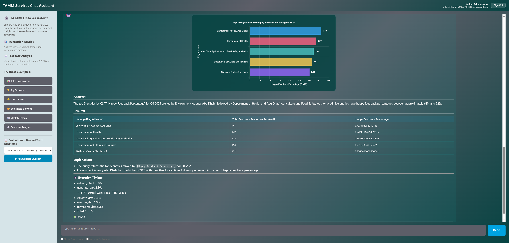

# NLtoDAX Solution Architecture — Component Documentation

This document provides a detailed description of every component in the NLtoDAX production architecture. Each component includes a one-sentence summary followed by a detailed explanation of its role in the solution.

---

## Table of Contents

1. [User](#1-user)
2. [Container Apps — FE (Frontend)](#2-container-apps--fe-frontend)
3. [Container Apps — BE (Backend)](#3-container-apps--be-backend)
4. [Container Registry (ACR)](#4-container-registry-acr)
5. [Source Repository (GitHub)](#5-source-repository-github)
6. [AI Foundry Models / Compass](#6-ai-foundry-models--compass)
7. [Azure Cosmos DB](#7-azure-cosmos-db)
8. [Azure Storage](#8-azure-storage)
9. [Azure Cache for Redis](#9-azure-cache-for-redis)
10. [Microsoft Fabric](#10-microsoft-fabric)
11. [Monitoring and Observability](#11-monitoring-and-observability)
    - [Application Insights](#11a-application-insights)
    - [Azure Monitor](#11b-azure-monitor)
    - [Log Analytics Workspace](#11c-log-analytics-workspace)
12. [Security and Identity](#12-security-and-identity)
    - [Azure Key Vault](#12a-azure-key-vault)
    - [Microsoft Entra ID](#12b-microsoft-entra-id)
13. [Network](#13-network)

---

## 1. User

**What it is**: An authenticated business user accessing the NLtoDAX chat interface through a web browser.

**Role in this architecture**: The user initiates the entire workflow by typing natural language questions about business data (e.g., "top 10 products by revenue last quarter"). The user authenticates via Microsoft Entra ID using MSAL.js, which obtains an access token. This token is sent with every request to the backend, where it's validated and exchanged via the OBO (On-Behalf-Of) flow to obtain a delegated Power BI token. This ensures the user can only query Power BI datasets they have permission to access. The user receives streaming responses (SSE) including the generated DAX query, validation status, query results, formatted answers, and optional chart visualizations.

---

## 2. Container Apps — FE (Frontend)

**What it is**: An Azure Container App running an nginx web server that serves the static frontend files (HTML, CSS, JavaScript).

**Role in this architecture**: This container serves the single-page application that provides the chat interface. It hosts three static files — `index.html`, `styles.css`, and `script.js` — along with CDN-loaded libraries (MSAL.js for authentication, Marked.js for Markdown rendering, Chart.js for data visualization). nginx acts as the web server, delivering these files to the browser and proxying `/api/*` requests to the backend Container App. The frontend handles user authentication (MSAL.js token acquisition), sends questions to the backend via HTTP POST, consumes Server-Sent Events (SSE) for streaming responses, and renders the results including formatted text and charts. It has no business logic — it's a thin presentation layer that delegates all processing to the backend. The container image is pulled from Azure Container Registry on deployment.

---

## 3. Container Apps — BE (Backend)

**What it is**: An Azure Container App running the FastAPI Python backend that orchestrates the entire NLtoDAX agent workflow.

**Role in this architecture**: This is the core of the solution — the Backend-for-Frontend (BFF) that handles everything between the user's question and the final answer. It performs five critical functions:

1. **Authentication & Authorization**: Validates the user's JWT token, performs the OBO token exchange to obtain a delegated Power BI token, and ensures per-user data access control.

2. **Agent Orchestration**: Runs the deterministic 5-step workflow — Intent Extraction → DAX Generation → DAX Validation → DAX Execution → Result Formatting — managed by the `ProcessFlowManager`. Each step is an executor that may invoke an LLM call or external service.

3. **LLM Interaction**: Calls Azure OpenAI (via AI Foundry models) using Semantic Kernel for intent classification, DAX query generation, DAX validation, and result formatting.

4. **Data Execution**: Connects to Power BI's XMLA endpoint (via ADOMD.NET through pythonnet) to execute validated DAX queries using the user's delegated token.

5. **Streaming**: Returns results to the frontend as Server-Sent Events, streaming each workflow step's output (intent, DAX query, validation result, query results, formatted answer, chart configuration) as it completes.

The backend uses a Managed Identity to access Key Vault, Redis, Storage, and Container Registry without storing secrets in code. OBO tokens are cached in Redis to avoid redundant token exchanges. Schema files (Power BI model metadata) are loaded from Azure Storage (with Redis as a read-through cache) and injected into LLM prompts for context-aware DAX generation.

---

## 4. Container Registry (ACR)

**What it is**: Azure Container Registry — a private Docker registry that stores the container images for both the frontend and backend Container Apps.

**Role in this architecture**: ACR serves as the single source of truth for deployable container images. When code is pushed to the source repository, a webhook triggers a `docker build` and `docker push` to ACR, creating versioned images (e.g., `nltodax-backend:v1.2.3`, `nltodax-frontend:v1.2.3`). Both Container Apps pull their images from ACR at deployment time. ACR is configured with a private endpoint inside the VNet so that image pulls happen over the Azure backbone network, not the public internet. The backend Container App's Managed Identity is granted the `AcrPull` role, eliminating the need for registry credentials. ACR also provides vulnerability scanning on pushed images, adding a security layer to the CI/CD pipeline.

---

## 5. Source Repository (GitHub)

**What it is**: The GitHub repository containing all source code, Dockerfiles, infrastructure-as-code templates, and CI/CD pipeline definitions for the NLtoDAX solution.

**Role in this architecture**: The source repository is the origin of the entire deployment pipeline. It contains the FastAPI backend code, frontend static files, Dockerfiles for both containers, prompt templates, schema extraction scripts, ground truth evaluation datasets, and deployment documentation. When a developer pushes code changes, a webhook triggers the CI/CD pipeline that builds new container images and pushes them to ACR. The repository also stores the Bicep/ARM templates or Terraform configurations for provisioning all Azure services in the architecture. It serves as the audit trail for all code changes — critical for governance and compliance in the Citadel Agent Spoke model.

---

## 6. AI Foundry Models / Compass

**What it is**: Azure AI Foundry project hosting the Azure OpenAI model deployments (e.g., GPT-5-mini) used by the agent for natural language understanding and generation.

**Role in this architecture**: AI Foundry provides the LLM inference endpoints that the backend calls for four distinct operations:

1. **Intent Extraction** — classifying the user's question into a domain category (transactions, feedback, product) to select the correct schema.
2. **DAX Generation** — converting the natural language question into a syntactically correct DAX query using the injected schema context.
3. **DAX Validation** — reviewing the generated DAX for syntax errors, semantic correctness, and schema compliance before execution.
4. **Result Formatting** — transforming raw query results into a human-readable narrative answer with optional chart recommendations.

The backend authenticates to AI Foundry using Managed Identity (or client credentials) and calls the model via the Azure OpenAI SDK through Semantic Kernel. AI Foundry also provides model versioning, content filtering, and rate limiting. In the Citadel architecture, AI Foundry is the model governance layer — the Citadel Governance Hub (CGH) can enforce policies on which models are available, token rate limits, and content safety filters across all spokes.

---

## 7. Azure Cosmos DB

**What it is**: A globally distributed, multi-model NoSQL database service used for persistent document storage.

**Role in this architecture**: Cosmos DB appears in two contexts in this architecture. In the **Knowledge sources and tools** group, it stores reference data and knowledge base content that the agent may query for context enrichment (e.g., product catalogs, business glossaries, historical query patterns). As a standalone service connected to the backend, it can serve as the persistent store for conversation history, user sessions, evaluation results, and audit logs. Cosmos DB's serverless pricing tier makes it cost-effective for low-volume workloads, and its JSON document model aligns naturally with storing structured agent workflow outputs (intent results, DAX queries, validation results, formatted answers) as complete documents. For the initial CAS deployment, some of these storage needs may be covered by Azure Storage (Blob) and Redis, with Cosmos DB used when richer querying over historical data is required (e.g., "show me all failed DAX queries for transactions intent in the last 30 days").

---

## 8. Azure Storage

**What it is**: Azure Blob Storage — object storage for unstructured data like files, logs, and large text content.

**Role in this architecture**: Azure Storage serves as the durable persistence layer for the NLtoDAX solution. Its primary function is storing **schema files** — the extracted Power BI model metadata (table definitions, column names, measures, relationships) that are injected into LLM prompts for context-aware DAX generation. These schema files (~78KB each) are extracted from Power BI by the `automated_schema_extract.py` script and uploaded to Blob Storage as the source of truth. The backend reads schema from Blob Storage (with Redis as a read-through cache — cache-aside pattern with 24-hour TTL) on each query. Azure Storage also stores chat history archives, evaluation datasets (`ground_truth_queries.csv`), and prompt templates. It's accessed via a private endpoint within the VNet, and the backend's Managed Identity is granted the `Storage Blob Data Reader` role for secure, keyless access.

---

## 9. Azure Cache for Redis

**What it is**: A managed in-memory data store providing sub-millisecond data access for caching and state management.

**Role in this architecture**: Redis serves three caching functions in the NLtoDAX backend:

1. **OBO Token Cache**: After the backend performs an OBO token exchange to obtain a user's delegated Power BI token, the token is cached in Redis (keyed by user OID, with TTL matching the token's expiration). This avoids redundant OBO exchanges on subsequent requests from the same user — a critical performance optimization since OBO exchanges add ~200-500ms per request.

2. **Schema Cache**: Power BI model schemas (~78KB each) are read from Blob Storage and cached in Redis with a 24-hour TTL (cache-aside pattern). When the schema extraction script runs (daily/weekly), it invalidates the Redis key, forcing the next request to re-read from Blob. This ensures 99.9% of requests get schema in <1ms instead of ~30ms from Blob.

3. **Workflow State**: Temporary workflow state (active request tracking, rate limiting counters) can be stored in Redis for fast access across concurrent requests.

Redis is accessed via a private endpoint within the VNet. The Basic C0 tier (~$16/month) is sufficient for the expected workload, with upgrade to Standard C0 (~$41/month) recommended for production SLA guarantees and data persistence across restarts.

---

## 10. Microsoft Fabric

**What it is**: Microsoft's unified analytics platform that integrates data engineering, data warehousing, real-time analytics, and Power BI.

**Role in this architecture**: Microsoft Fabric is the **data platform layer** that hosts the Power BI datasets the NLtoDAX agent queries. In this architecture, Fabric provides the XMLA endpoint that the backend's `DaxQueryExecutor` connects to for executing DAX queries. The Power BI semantic models (datasets) within Fabric define the tables, columns, measures, and relationships that constitute the "knowledge" the agent reasons about. The schema extraction script connects to Fabric to pull model metadata (DMV queries), which is then stored in Azure Storage as the schema files injected into LLM prompts. Fabric also provides row-level security (RLS) enforcement — when the backend executes a DAX query using the user's delegated OBO token, Fabric applies the same data access rules the user would see in Power BI reports. This ensures the NLtoDAX agent inherits the organization's data governance model without any custom authorization logic.

---

## 11. Monitoring and Observability

### 11a. Application Insights

**What it is**: An Application Performance Management (APM) service that provides distributed tracing, request monitoring, and custom telemetry for applications.

**Role in this architecture**: Application Insights is the primary observability layer for the NLtoDAX backend. It captures three categories of telemetry:

1. **Infrastructure telemetry**: HTTP request rates, response times, error rates (4xx/5xx), dependency call durations (Redis, Blob Storage, XMLA, Azure OpenAI), container health, and exception stack traces.

2. **LLM-specific telemetry**: Via the custom `trace_llm_call()` instrumentation, it logs full prompts, completions, token counts (prompt/completion/total), cost calculations (USD per query), TTFT/TTLT latency, prompt version identifiers, and quality scores (DAX validation results). This data lands in the `customEvents` table and is queryable via KQL.

3. **End-to-end distributed traces**: OpenTelemetry spans for each workflow step (intent extraction, DAX generation, DAX validation, DAX execution, result formatting), correlated via trace IDs, enabling drill-down from a slow request to the exact bottleneck executor.

Application Insights sends all telemetry to the Log Analytics workspace, where it can be queried, dashboarded, and forwarded to the CGH central Log Analytics workspace via diagnostic settings.

### 11b. Azure Monitor

**What it is**: Azure's unified monitoring platform that collects, analyzes, and acts on telemetry from Azure resources and applications.

**Role in this architecture**: Azure Monitor serves as the alerting and metrics aggregation layer. It consumes metrics from all Azure resources in the architecture — Container Apps (CPU, memory, replica count, HTTP request count), Redis (cache hit ratio, memory usage, connected clients), Blob Storage (request latency, availability), ACR (image pull latency), and AI Foundry (token consumption, throttling). Azure Monitor Alert Rules are configured to detect operational issues: container restart loops, Redis memory pressure, OBO token exchange failures, DAX validation success rate drops below threshold, LLM latency spikes, and error rate increases. Alerts route to action groups that notify via email, Teams, or webhook. Azure Monitor is the control plane that ensures the NLtoDAX spoke operates within its SLOs.

### 11c. Log Analytics Workspace

**What it is**: A centralized log store and query engine that collects structured log data from all Azure services and applications, queryable via Kusto Query Language (KQL).

**Role in this architecture**: Log Analytics is the single pane of glass for all operational data in the NLtoDAX spoke. It receives data from three sources:

1. **Application Insights telemetry** — requests, dependencies, custom events with LLM prompts/completions/costs.
2. **Azure resource diagnostic logs** — Container Apps console logs, Redis connection events, Blob Storage access logs, Key Vault access audit logs.
3. **Azure Monitor platform metrics** — resource health and performance data from all services.

All KQL queries — whether for debugging a failed DAX query, analyzing cost trends, comparing prompt versions, or building Azure Workbook dashboards — run against this workspace. In the Citadel architecture, this workspace is the spoke's observability boundary. When the CGH is deployed, diagnostic settings are configured to forward a subset of logs (or all logs) to the CGH's central Log Analytics workspace via VNet peering, enabling organization-wide AI governance monitoring without granting central teams direct access to the spoke's resources.

---

## 12. Security and Identity

### 12a. Azure Key Vault

**What it is**: A cloud service for securely storing and managing secrets, encryption keys, and certificates.

**Role in this architecture**: Key Vault is the centralized secrets store for the NLtoDAX spoke. It holds the application secrets that the backend needs but must never be stored in code or environment variables:

- `CLIENT_SECRET_POWERBI` — for OBO token exchange with Power BI
- `CLIENT_SECRET_OPENAI` — for Azure OpenAI authentication (if not using Managed Identity)
- Redis connection strings
- Blob Storage connection strings
- Any other sensitive configuration values

The backend's Managed Identity is granted the `Key Vault Secrets User` role, allowing it to read secrets at runtime without any credentials in the container image or app configuration. Key Vault access is restricted to the VNet via a private endpoint, and all access events are logged to Log Analytics for audit compliance. In the Citadel model, Key Vault audit logs can be forwarded to the CGH for centralized secrets access monitoring across all spokes.

### 12b. Microsoft Entra ID

**What it is**: Microsoft's cloud identity and access management service (formerly Azure Active Directory).

**Role in this architecture**: Entra ID is the identity foundation for every authenticated interaction in the architecture. It serves four distinct functions:

1. **User Authentication**: The frontend uses MSAL.js to authenticate the user against Entra ID, obtaining an access token scoped to the NLtoDAX backend API (`api://<backend-app-id>/access_as_user`).

2. **Token Validation**: The backend validates the user's JWT token against Entra ID's JWKS endpoint, confirming the token's signature, audience, issuer, and expiration.

3. **OBO Token Exchange**: The backend uses the user's token as an assertion to request a delegated Power BI token from Entra ID via the OBO flow. This gives the backend a token that represents the user's identity and permissions when calling Power BI/Fabric.

4. **Managed Identity**: Entra ID issues system-assigned managed identities for the Container Apps, which are used to authenticate to Key Vault, ACR, Storage, and Redis — eliminating service-to-service secrets entirely.

Two App Registrations exist in Entra ID: one for the frontend SPA (public client, MSAL.js redirect URIs) and one for the backend API (confidential client, API scopes, OBO permissions for Power BI). Entra ID is external to the spoke's VNet — it's a global Microsoft service that all spokes share.

---

## 13. Network

### Virtual Network (VNet)

**What it is**: An isolated Azure network that provides private, secure communication between all resources in the spoke.

**Role in this architecture**: The VNet is the dashed boundary visible in the architecture diagram — it encapsulates the Container Apps Environment, Container Registry, and connects via private endpoints to Redis, Storage, Key Vault, and AI Foundry. All service-to-service traffic stays on the Azure backbone network and never traverses the public internet. The VNet is divided into subnets:

- **Container Apps subnet** — delegated to `Microsoft.App/environments`, hosts both frontend and backend Container Apps
- **Private endpoints subnet** — hosts private endpoints for Redis, Storage, Key Vault, ACR, and AI Foundry
- **CGH peering subnet** (future) — reserved for VNet peering with the Citadel Governance Hub

When the CGH is deployed, the spoke VNet is peered with the CGH VNet, enabling centralized policy enforcement, DNS resolution, and log forwarding without exposing spoke resources to the internet.

---

## Services Summary

| # | Service | Category | Required |
|---|---------|----------|----------|
| 1 | Container Apps — FE | Compute | Yes |
| 2 | Container Apps — BE | Compute | Yes |
| 3 | Container Registry (ACR) | Compute | Yes |
| 4 | AI Foundry Models / Compass | AI | Yes |
| 5 | Azure Cosmos DB | Data | Optional (can use Blob + Redis initially) |
| 6 | Azure Storage | Data | Yes |
| 7 | Azure Cache for Redis | Data | Yes |
| 8 | Microsoft Fabric | Data | Yes (Power BI XMLA endpoint) |
| 9 | Application Insights | Observability | Yes |
| 10 | Azure Monitor | Observability | Yes |
| 11 | Log Analytics Workspace | Observability | Yes |
| 12 | Azure Key Vault | Security | Yes |
| 13 | Microsoft Entra ID | Security | Yes |
| 14 | Virtual Network | Networking | Yes |
| 15 | Private Endpoints + DNS Zones | Networking | Yes (production) |
| 16 | Source Repository (GitHub) | DevOps | Yes |