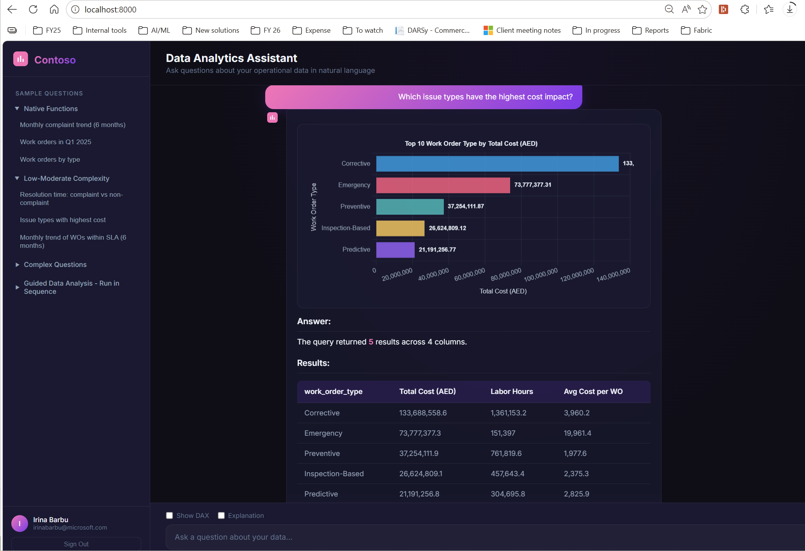

# NLtoDAX - Natural Language to DAX Query Generator

A chat-based application that converts natural language questions into DAX queries and executes them against Power BI semantic models.



---

## 📋 Solution Setup Guide

### Prerequisites

- Azure subscription with access to:
  - Azure Active Directory (Entra ID)
  - Azure AI Foundry
  - Power BI workspace with XMLA read/write enabled
- Python 3.10+
- Power BI Premium or PPU workspace

---

## Step 1: App Registrations

Two app registrations are required:

| App Registration | Purpose |
|-----------------|---------|
| **Power BI Service** | Generates tokens on behalf of users to execute queries against Power BI datasets |
| **Azure OpenAI Service** | Service principal identity for calling LLM models via AI Foundry |

---

### 1.1 App Registration for Power BI Service

1. Open [portal.azure.com](https://portal.azure.com)

2. Navigate to **App registrations**

3. Click **+ New registration**
   - **Name:** `app_powerbi_sem_model` (or your preferred name)
   - Click **Register**

4. Configure API Permissions:
   - Go to **Manage** → **API permissions**
   - Click **+ Add a permission**
   - Select **Power BI Service**
   - Choose **Delegated permissions**
   - Select the following permissions:
     - ✅ `Connection.Read.All`
     - ✅ `Dataset.Read.All`
     - ✅ `Item.ReadWrite.All`
     - ✅ `SemanticModel.Read.All`
     - ✅ `Workspace.Read.All`
   - Click **Add permissions**

5. Record Application ID:
   - Go to **Overview**
   - Copy **Application (client) ID**
   - Add to `.env` file:
     ```
     CLIENT_ID=<your-application-id>
     ```

6. Create Client Secret:
   - Go to **Manage** → **Certificates & secrets**
   - Click **+ New client secret**
   - Add a description and select expiry
   - Click **Add**
   - ⚠️ **Copy the secret value immediately** (it won't be shown again)
   - Add to `.env` file:
     ```
     CLIENT_SECRET=<your-client-secret>
     ```

---

### 1.1.1 Configure API Exposure (for BFF + OBO Authentication)

The frontend uses MSAL.js to authenticate users. The backend then exchanges the user's token for a Power BI token using the On-Behalf-Of (OBO) flow. This requires exposing an API scope.

#### Set Application ID URI

1. In your app registration, go to **Expose an API**

2. At the top, you'll see **Application ID URI**:
   - If empty, click **Set** or **Add**
   - Enter:
     ```
     api://<your-client-id>
     ```
     Example: `api://f3621d5a-4572-4770-9550-d156f5793b20`
   - Click **Save**

#### Add the `access_as_user` Scope

1. Still under **Expose an API**, click **+ Add a scope**

2. Fill in the scope details:
   - **Scope name:** `access_as_user`
   - **Who can consent:** Admins and users
   - **Admin consent display name:** `Access the API as the signed-in user`
   - **Admin consent description:** `Allows the application to call this API on behalf of the signed-in user.`
   - **User consent display name:** `Access the API as you`
   - **User consent description:** `Allows this application to access the API using your identity.`
   - **State:** Enabled

3. Click **Add scope**

4. Add the full scope to your `.env` file:
   ```
   API_SCOPE=api://<your-client-id>/access_as_user
   ```

> **Note:** The full scope URI `api://<client-id>/access_as_user` is what MSAL.js will request from the frontend.

---

### 1.1.2 Configure Redirect URI (for SPA Authentication)

The frontend uses MSAL.js popup authentication, which requires a properly configured redirect URI.

1. In your app registration, go to **Authentication**

2. Under **Platform configurations**, click **+ Add a platform**

3. Select **Single-page application (SPA)**

4. Configure the redirect URI:
   - **Redirect URIs:** `http://localhost:8000`
   - Click **Configure**

5. Verify the configuration:
   - Under **Single-page application**, you should see:
     - ✅ `http://localhost:8000` listed as a redirect URI
   - **Implicit grant and hybrid flows** section:
     - Leave **Access tokens** and **ID tokens** unchecked (MSAL.js 2.x uses PKCE, not implicit flow)

> **Note:** For production deployment, add your production URL (e.g., `https://your-app.azurewebsites.net`) as an additional redirect URI.

---

### 1.2 App Registration for Azure OpenAI Service

1. Open [portal.azure.com](https://portal.azure.com) → **App registrations**

2. Click **+ New registration**
   - **Name:** `app_azureopenai_chatwsemmodel` (or your preferred name)
   - Click **Register**

3. Record Application ID:
   - Go to **Overview**
   - Copy **Application (client) ID**
   - Add to `.env` file:
     ```
     CLIENT_ID_OPENAI=<your-application-id>
     ```

4. Create Client Secret:
   - Go to **Manage** → **Certificates & secrets**
   - Click **+ New client secret**
   - Add to `.env` file:
     ```
     CLIENT_SECRET_OPENAI=<your-client-secret>
     ```

5. Configure API Permissions:
   - Go to **Manage** → **API permissions**
   - Click **+ Add a permission**
   - Select **Microsoft Graph** → **Delegated permissions**
   - Select: ✅ `User.Read`
   - Click **Add permissions**

6. Grant Access to AI Foundry Resource:
   - Open [portal.azure.com](https://portal.azure.com)
   - Navigate to your **Azure AI Foundry** resource (where LLM model is provisioned)
   - Go to **Access Control (IAM)**
   - Click **+ Add role assignment**
   - Select role: **Cognitive Services OpenAI Contributor**
   - Select members: Search for the app registration you just created
   - Click **Review + assign**

---

## Step 2: LLM Model Provisioning

You need to provision an LLM model within Azure AI Foundry portal.

> **Note:** For initial testing, `gpt-5-mini` model with Global Standard deployment is acceptable.

### Steps:

1. Open [Microsoft AI Foundry](https://ai.azure.com/)

2. Navigate to **Models and endpoints**

3. Click **Deploy model** → **Deploy base model**

4. Select **gpt-5-mini** (or your preferred model)

5. Configure deployment:
   - **Deployment type:** Global Standard *(for testing purposes only)*
   - Click **Deploy**

6. Open deployed model details page and copy the following to your `.env` file:

```env
# Azure OpenAI
AZURE_OPENAI_ENDPOINT=https://<your-resource>.cognitiveservices.azure.com
AZURE_OPENAI_DEPLOYMENT=gpt-5-mini
AZURE_OPENAI_API_VERSION=2025-04-01-preview
```

> **Note:** The endpoint should look like `https://{resource-name}.cognitiveservices.azure.com`

---

## Step 3: Power BI Configuration

### XMLA Endpoint Setup

1. Ensure your Power BI workspace has **Premium Per User (PPU)** or **Premium capacity**

2. Enable XMLA read/write in Power BI Admin Portal

3. Add the following to your `.env` file:

```env
# XMLA target
WORKSPACE_NAME=<your-workspace-name>
DATABASE_NAME=<your-semantic-model-name>
```

---

## Step 4: Environment Configuration

Create a `.env` file in the project root with all required variables:

```env
# Tenant Configuration
TENANT_ID=<your-tenant-id>

# Power BI App Registration
CLIENT_ID=<power-bi-app-client-id>
CLIENT_SECRET=<power-bi-app-client-secret>

# API Scope for BFF + OBO Authentication
API_SCOPE=api://<power-bi-app-client-id>/access_as_user

# Azure OpenAI App Registration
CLIENT_ID_OPENAI=<openai-app-client-id>
CLIENT_SECRET_OPENAI=<openai-app-client-secret>

# Azure OpenAI
AZURE_OPENAI_ENDPOINT=https://<your-resource>.cognitiveservices.azure.com
AZURE_OPENAI_DEPLOYMENT=gpt-5-mini
AZURE_OPENAI_API_VERSION=2025-04-01-preview

# XMLA target
WORKSPACE_NAME=<your-workspace-name>
DATABASE_NAME=<your-semantic-model-name>

# ADOMD.NET DLL path
ADOMD_DLL=<path-to-adomd-dll>
```

---

## Step 5: Python Environment Setup

### 5.1 Verify Python Version

Ensure you have **Python 3.12.10** installed:

```bash
python --version
```

Expected output:
```
Python 3.12.10
```

> **Note:** If you don't have Python 3.12.10, download it from [python.org](https://www.python.org/downloads/)

### 5.2 Create Virtual Environment

Create and activate a virtual environment:

**Windows (PowerShell):**
```powershell
# Create virtual environment
python -m venv nltodax_venv

# Activate virtual environment
.\nltodax_venv\Scripts\Activate.ps1
```

**Windows (Command Prompt):**
```cmd
# Create virtual environment
python -m venv nltodax_venv

# Activate virtual environment
nltodax_venv\Scripts\activate.bat
```

**macOS/Linux:**
```bash
# Create virtual environment
python -m venv nltodax_venv

# Activate virtual environment
source nltodax_venv/bin/activate
```

> ✅ You should see `(nltodax_venv)` at the beginning of your terminal prompt when activated.

---

## Step 6: Install Dependencies

With your virtual environment activated:

```bash
pip install -r requirements.txt
```

---

## Step 7: Run the Application

```bash
python app.py
```

The application will be available at `http://localhost:8000`

---

## � Running with Docker (Recommended)

Docker is the easiest way to get the application running — no Python, no virtual environment, no dependency installation required.

### Prerequisites

- [Docker Desktop](https://www.docker.com/products/docker-desktop/) installed and running

### Quick Start

```bash
# 1. Clone the repo and switch to the dev_local branch
git clone https://github.com/irinaeba/NLtoDAX_POC.git
cd NLtoDAX_POC
git checkout dev_local

# 2. Create your .env file from the template
cp env.template .env
# Edit .env and fill in your values (see Step 4 above for reference)

# 3. Build and start the container
docker compose up --build -d

# 4. Verify the container is healthy (~40s for first startup)
docker ps                                # STATUS should show "(healthy)"
curl http://localhost:8000/health         # Returns {"status":"healthy",...}

# 5. Open the UI
# Browse to http://localhost:8000
```

### Common Docker Commands

```bash
# View logs
docker logs nltodax-app -f

# Stop the container
docker compose down

# Rebuild after pulling new code changes
git pull
docker compose up --build -d

# Restart the container
docker compose restart
```

### Notes

- The `.env` file is **never** baked into the image — it is loaded at runtime via `env_file`
- The `cache/` directory is mounted as a volume so schema files persist across rebuilds
- The container exposes port **8000** (same as local development)
- A built-in healthcheck pings `/health` every 30 seconds

---

## �📁 Project Structure

```
NLtoDAX/
├── app.py                 # Main FastAPI application
├── Dockerfile             # Multi-stage Docker build
├── docker-compose.yml     # Docker Compose orchestration
├── env.template           # Environment variables template
├── requirements.txt
├── backend/
│   ├── executors/         # Workflow executors
│   ├── prompts/
│   │   ├── prompt_generator/  # DAX generation prompts (per domain)
│   │   └── prompt_validator/  # DAX validation prompts (per domain)
│   ├── tools/             # Core tools (auth, DAX execution, chart viz)
│   └── evaluations/       # Evaluation scripts and ground truth
├── frontend/              # Chat UI (HTML/CSS/JS)
├── cache/
│   └── schema/            # Cached semantic model schemas
├── schema_extraction/     # Schema extraction utilities
└── lib/                   # ADOMD.NET DLL (local dev only)
```

---

## �️ Environment Setup (Quick Start)

Follow these steps to set up the application from scratch:

### 1. Create `.env` file

Copy the template and fill in your values:

```bash
cp env.template .env
```

Required variables:

```env
TENANT_ID=<your-azure-ad-tenant-id>

# Power BI App Registration
CLIENT_ID_POWERBI=<power-bi-app-client-id>
CLIENT_SECRET_POWERBI=<power-bi-app-client-secret>
API_SCOPE=api://<power-bi-app-client-id>/access_as_user

# Schema Extraction Service Principal (can be same as Power BI app)
CLIENT_ID_POWERBI_SCHEMA_EXTRACTION=<schema-extraction-client-id>
CLIENT_SECRET_POWERBI_SCHEMA_EXTRACTION=<schema-extraction-client-secret>

# Azure OpenAI
CLIENT_ID_OPENAI=<openai-app-client-id>
CLIENT_SECRET_OPENAI=<openai-app-client-secret>
AZURE_OPENAI_ENDPOINT=https://<your-resource>.cognitiveservices.azure.com
AZURE_OPENAI_DEPLOYMENT=<your-deployment-name>
AZURE_OPENAI_API_VERSION=2025-04-01-preview

# LLM Provider Toggle ("azure" or "compass")
LLM_PROVIDER=azure

# Power BI Workspace / Semantic Model
WORKSPACE_NAME=<your-workspace-name>
WORKSPACE_ID=<your-workspace-guid>
DATABASE_NAME=<your-semantic-model-name>
DATASET_ID=<your-dataset-guid>
```

### 2. Configure Domain Schema Extraction

Edit `schema_extraction/domain_configs.py` to match your semantic model's domain structure.

This file defines how the full schema is split into domain-specific prompts. Each domain config specifies:
- Which fact table(s) belong to the domain
- Which dimension tables to include
- Output file prefix and description

> **Note:** This is already configured for the demo data (`SM_SyntheticData_DEMO`). Update if connecting to your own model.

### 3. Run Schema Extraction

Extract the schema from your Power BI semantic model via the XMLA endpoint:

```bash
python schema_extraction/automated_schema_extract.py --save-json
```

This will:
- Connect to Power BI via XMLA (uses `CLIENT_ID_POWERBI_SCHEMA_EXTRACTION` credentials)
- Extract all tables, columns, measures, and relationships
- Save the full schema as JSON and formatted text
- Split into domain-specific schemas under `cache/schema/`

Output files:
```
cache/schema/
├── schema_pack_<date>.json        # Full schema (JSON)
├── schema_pack_<date>.txt         # Full schema (formatted text)
├── schema_work_orders.txt         # Domain: work orders
├── schema_complaints.txt          # Domain: citizen complaints
├── schema_maintenance_costs.txt   # Domain: maintenance costs
└── schema_asset_downtime.txt      # Domain: asset downtime
```

> **Prerequisites:** Requires Windows with ADOMD.NET DLL (`lib/net45/` or `lib/netcore/`), `pyadomd`, and XMLA read enabled on the workspace.

### 4. Build and Run with Docker

```bash
# Build the container
docker compose up --build -d

# Verify it's healthy (~30s for first startup)
docker ps                          # STATUS should show "(healthy)"
curl http://localhost:8000/health   # Returns {"status":"healthy",...}

# Open the UI
# Browse to http://localhost:8000
```

The Docker container:
- Uses Python 3.12-slim with a multi-stage build
- Loads `.env` at runtime (never baked into the image)
- Exposes port **8000**
- Includes a healthcheck that pings `/health` every 30s
- Copies `backend/`, `frontend/`, `cache/`, and `schema_extraction/` into the image

Common commands:
```bash
docker logs nltodax-app -f           # Follow logs
docker compose down                  # Stop
docker compose up -d --build         # Rebuild after code changes
docker compose restart               # Restart without rebuild
```

---

## �🔧 Troubleshooting

### Authentication Errors
- Ensure all app registrations have correct permissions
- Verify client secrets haven't expired
- Check that the OpenAI app has the Cognitive Services role assigned

### XMLA Connection Issues
- Verify XMLA read/write is enabled on the workspace
- Ensure the user has appropriate permissions on the semantic model
- Check the ADOMD_DLL path is correct

---

## 📄 License

This project is for demonstration purposes.
