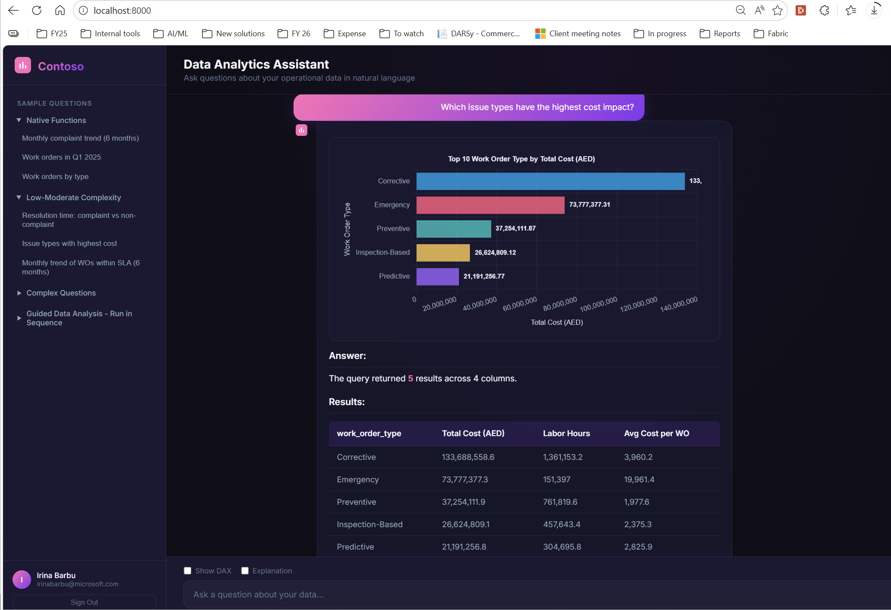

# NLtoDAX - Natural Language to DAX Query Generator

A chat-based application that converts natural language questions into DAX queries and executes them against Power BI semantic models.



---

## [Solution Setup Guide →](docs/SOLUTION_SETUP.md)

Follow the complete setup instructions for app registration, Azure OpenAI, Power BI, local development, and Docker.

[Open the setup guide →](docs/SOLUTION_SETUP.md)

---

## Project Structure

```text
NLtoDAX/
├── .github/
│   └── workflows/              # Application and infrastructure deployment workflows
├── admin_portal/               # Admin API and frontend for schema management
│   ├── app.py
│   ├── Dockerfile
│   └── frontend/
├── app.py                 # Main FastAPI application
├── Dockerfile             # Multi-stage Docker build
├── docker-compose.yml     # Docker Compose orchestration
├── env.template           # Environment variables template
├── requirements.txt
├── backend/
│   ├── agent_workflow.py   # Query planning and DAX workflow orchestration
│   ├── auth/               # Token validation and Power BI OBO authentication
│   ├── executors/         # Workflow executors
│   ├── native_functions/  # Native function registry and matching
│   ├── prompts/
│   │   ├── analyst_agent_prompt.py
│   │   ├── answer_formatter_prompt.py
│   │   ├── prompt_generator/  # DAX generation prompts (per domain)
│   │   ├── prompt_validator/  # DAX validation prompts (per domain)
│   │   └── query_planner_prompt.py
│   ├── storage/            # Local and Azure Blob storage/version management
│   ├── tools/             # Core tools (auth, DAX execution, chart viz)
│   ├── evaluations/       # Evaluation scripts and ground truth
│   └── utils/             # Shared utilities
├── frontend/              # Chat UI (HTML/CSS/JS)
├── cache/
│   └── schema/            # Cached semantic model schemas
├── docs/                  # Setup, architecture, and workflow documentation
├── infra/                 # Azure Bicep modules and deployment parameters
├── schema_extraction/     # Schema extraction utilities and extraction job
└── lib/                   # ADOMD.NET DLL (local dev only)
```

---

## 📄 License

This project is for demonstration purposes.
